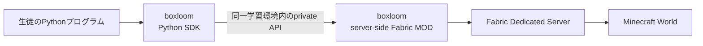

# boxloom

`boxloom`は、PythonからMinecraft Java Editionのワールドを操作するための、Python SDKとサーバー用Fabric MODを提供するプロジェクトです。

このリポジトリでは、次の2つの成果物を同じ名前で管理・配布することを想定しています。

- Pythonライブラリ: `boxloom`
- サーバー用Fabric MOD: `boxloom`

> [!IMPORTANT]
> 現在は設計初期段階です。公開API、通信方式、対応Minecraftバージョン、配布方法はまだ確定していません。

## 目的

教材で使用するPythonコードと、Minecraftサーバー内のワールド操作を、小さく安定したAPIで接続します。



クラウド学習環境では、Python SDKとFabric MODを同じ生徒用VM内で動かします。両者の通信は外部インターネットを経由せず、MODの内部APIをインターネットへ公開しません。

## 同じリポジトリで管理する理由

- Python向けAPIとMOD側の実装を、同じ変更単位でレビューできる
- SDKとMODの互換性テストを1か所で管理できる
- API契約、サンプル、ドキュメントのずれを検出しやすい
- Minecraft、Fabric、SDK、MODの対応関係を追跡できる
- 破壊的変更と移行手順を1つのリリース計画として整理できる

同じリポジトリで管理しても、PythonパッケージとFabric MODを常に同じバージョン番号にするとは限りません。バージョニングとリリース単位は、互換性方針と合わせて今後決定します。

## コンポーネントの責務

### Python SDK

- 教材から利用するPython APIを提供する
- MinecraftやFabricの実装詳細を教材コードから隠す
- 接続先や認証情報の受け渡しを抽象化する
- MODから返された結果やエラーをPythonから扱える形に変換する
- ローカル環境とクラウド環境の配置差を、可能な範囲で吸収する

### server-side Fabric MOD

- Fabric Dedicated Server内で動作する
- Python SDKからの要求を受け取り、Minecraftワールドの操作へ橋渡しする
- 対象ワールド、プレイヤー、座標、操作種別、操作量をサーバー側で検証する
- 生徒コードを信頼せず、SDKを迂回した要求も安全側で拒否する
- Minecraftサーバーの状態と操作結果を、SDKへ返せる形にする

## APIの利用イメージ

次のコードは方向性を示すための例です。クラス名、関数名、引数、戻り値はまだAPI契約ではありません。

```python
from boxloom import Minecraft

mc = Minecraft()

mc.say("こんにちは")
mc.set_block(10, 64, 10, "gold_block")
```

## セキュリティ上の前提

`boxloom`は、生徒が任意のPythonコードを実行できる環境で使われます。

- Python SDKを認可境界として信頼しない
- MODの内部APIを外部インターネットへ公開しない
- SDKを経由せず内部APIを直接呼ばれる可能性を前提にする
- MOD側で入力、権限、対象範囲、件数、頻度を検証する
- Python実行環境へMinecraft管理権限やクラウド管理資格情報を渡さない
- RCONやMinecraftサーバーの管理ポートを通常の学習経路に使わない

具体的な認証方式、通信方式、rate limit、操作権限は今後の技術設計で決定します。

## 想定するリポジトリ構成

次は現時点の案であり、ビルドツールを選定するときに確定します。

```text
boxloom/
├── python/       # Python SDK
├── fabric/       # server-side Fabric MOD
├── docs/         # API契約と技術設計
├── examples/     # Pythonの利用例
└── README.md
```

## このリポジトリで扱わないもの

- 学習サービスのWebアプリとカリキュラム
- GCE VMの起動・停止やDNSを管理するコントロールプレーン
- `code-server`とworkspace gateway
- 生徒アカウント、保護者アカウント、講師アカウントの認証・認可
- Minecraft Java Editionクライアントや公式ランチャーの配布
- Minecraft本体のアセット

これらはCodorie側のアプリケーションおよびインフラ設計で扱います。

## 対応バージョン

次の組み合わせを互換性マトリクスとして管理する予定です。具体的なバージョンは未決定です。

| 対象 | バージョン |
| --- | --- |
| Minecraft Java Edition | 未決定 |
| Fabric Loader | 未決定 |
| Fabric API | 未決定 |
| Java | 未決定 |
| Python | 未決定 |
| boxloom Python SDK | 未決定 |
| boxloom Fabric MOD | 未決定 |

Snapshotや各依存関係の最新版へ自動追従せず、検証済みの組み合わせを明示して配布する方針です。

## 最初に決めること

1. Python SDKとFabric MOD間の最小API契約
2. 通信方式と、同一VM内での接続方法
3. 認証、認可、入力検証の境界
4. Minecraftサーバースレッドへ処理を渡す方法
5. 最初に提供するワールド操作
6. SDKとMODのバージョニング、互換性、リリース方法
7. PythonとFabricのビルド・テスト構成
8. ライセンス

## 関連ドキュメント

- [Codorie Learn: Minecraft Java Edition連携型学習環境 インフラアーキテクチャ設計](https://github.com/k-yokoishi/codorie/blob/develop/apps/learn/docs/minecraft-java-learning-architecture.md)

## ライセンス

未決定です。ライセンスが決まるまで、再配布や利用条件を推測しないでください。
