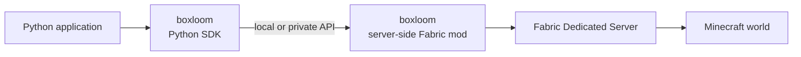

# boxloom

boxloom is a Python SDK and server-side Fabric mod for controlling Minecraft Java Edition through an application-facing API.

This repository is intended to produce two distributable artifacts under the same name:

- Python package: `boxloom`
- Fabric mod: `boxloom`

> [!IMPORTANT]
> boxloom is in the early design stage. Its public API, wire protocol, supported versions, packaging, and release process are not stable yet.

## Overview

boxloom provides a small Python interface for reading and changing a Minecraft world. The Python SDK sends requests to the server-side Fabric mod, which validates each request and performs the corresponding operation in the Fabric server.



The SDK and mod are expected to communicate within the same machine or a trusted private network. The mod's internal API is not intended to be exposed directly to the public internet.

## Goals

- Provide a focused, high-level Python API for Minecraft world operations
- Hide Fabric and Minecraft implementation details from Python applications
- Define a versioned contract between the Python SDK and the Fabric mod
- Return structured results and errors instead of relying on console output parsing
- Enforce operation permissions and limits on the server side
- Publish tested compatibility information for Minecraft, Fabric, Java, Python, the SDK, and the mod

## Components

### Python SDK

The Python package is responsible for:

- Exposing the public Python API
- Resolving connection configuration and credentials
- Encoding requests and decoding responses
- Mapping protocol failures to documented Python exceptions
- Hiding transport and deployment details from application code

### Server-side Fabric mod

The Fabric mod is responsible for:

- Running inside a Fabric Dedicated Server
- Receiving requests from the Python SDK
- Validating the requested operation, target world, coordinates, and resource limits
- Scheduling world reads and changes in the correct Minecraft server execution context
- Returning structured results and errors
- Keeping server authority and validation independent from SDK behavior

## Connection configuration

The Python SDK will initialize the following connection settings from environment variables:

- The boxloom Fabric mod API endpoint
- The API key used to authenticate requests to the Fabric mod

Applications may also provide these values explicitly through the Python API. Explicitly provided values override the defaults read from the environment.

The environment variable names and the exact Python configuration API have not been defined yet. The SDK must not include the API key in normal logs or error messages.

## API example

The following example illustrates the intended style. The class name, method names, parameters, and return values are not yet a stable API contract.

```python
from boxloom import Minecraft

mc = Minecraft()

mc.say("Hello from boxloom!")
mc.set_block(10, 64, 10, "minecraft:gold_block")
```

## Security model

Callers of the internal API must be treated as untrusted, even when they use the official Python SDK.

- The Python SDK is not an authorization boundary
- The Fabric mod must validate every operation independently
- The internal API must not listen on a public network interface by default
- Authentication and authorization must be enforced at the mod boundary
- World, coordinate, operation, payload-size, and rate limits must be enforced server-side
- RCON and other administrative interfaces must not be part of the normal boxloom API path
- Credentials for hosting platforms or infrastructure control must never be exposed to Python applications

The concrete authentication mechanism, transport security, rate limits, and permission model are still to be designed.

## Planned repository layout

The directory structure will be finalized together with the build systems. The current proposal is:

```text
boxloom/
|-- python/       # Python SDK
|-- fabric/       # Server-side Fabric mod
|-- docs/         # API contract and technical design
|-- examples/     # Python examples
`-- README.md
```

## Scope

This repository is expected to contain:

- The boxloom Python SDK
- The boxloom server-side Fabric mod
- The SDK-to-mod API specification
- Compatibility and versioning documentation
- Integration tests and example programs
- Packaging and release automation for both artifacts

The following are outside the scope of this repository:

- Hosting or lifecycle management for Minecraft servers
- Browser-based editors, authentication gateways, and control planes
- Distribution of Minecraft Java Edition, the official launcher, or Minecraft assets
- General-purpose remote administration of Minecraft servers

## Compatibility

boxloom will publish a tested compatibility matrix. Exact versions have not been selected yet.

| Component | Supported version |
| --- | --- |
| Minecraft Java Edition | To be determined |
| Fabric Loader | To be determined |
| Fabric API | To be determined |
| Java | To be determined |
| Python | To be determined |
| boxloom Python SDK | To be determined |
| boxloom Fabric mod | To be determined |

boxloom will target explicitly tested combinations instead of automatically following snapshots or the newest dependency releases.

## Current decisions

- The Python package name is `boxloom`
- The server-side Fabric mod name is `boxloom`
- Minecraft operations are exposed through an API rather than console-output parsing
- The Fabric mod is authoritative for validation and world access
- The SDK-to-mod endpoint is local or private and is not a public internet API
- The SDK reads the endpoint and Fabric mod API key defaults from environment variables
- Applications can override the environment-derived defaults through the Python API

## Open design questions

- The wire protocol and transport
- Environment variable names and the explicit connection-configuration API
- Authentication, authorization, and credential rotation
- Thread handoff and execution semantics inside the Minecraft server
- Timeouts, retries, idempotency, and cancellation
- Batch operations and partial failures
- The initial public Python API
- Version negotiation and compatibility policy
- Build, test, packaging, and release tooling
- License

## Initial roadmap

1. Define the smallest useful SDK-to-mod API contract
2. Select the transport and connection-discovery mechanism
3. Implement a minimal server-side Fabric mod
4. Implement the Python SDK client
5. Verify one read operation and one world-changing operation end to end
6. Add compatibility and security tests
7. Define packaging, versioning, and release workflows
8. Select and publish a license

## License

The license has not been selected yet. Public visibility of the source code does not grant permission to use, modify, or redistribute it until a license is added.
