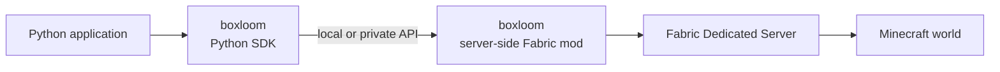

<p align="center">
  
</p>

# boxloom

boxloom is a Python SDK and server-side Fabric mod for controlling Minecraft Java Edition through an application-facing API.

This repository is intended to produce two distributable artifacts under the same name:

- Python package: `boxloom`
- Fabric mod: `boxloom`

> [!IMPORTANT]
> boxloom is in the early design stage. Its public API, wire protocol, supported versions, packaging, and release process are not stable yet.

## Overview

boxloom provides a small Python interface for reading and changing a Minecraft world. The Python SDK sends requests to the server-side Fabric mod, which validates each request and performs the corresponding operation in the Fabric server.



The SDK and mod are expected to communicate within the same machine or a trusted private network. The mod's internal API is not intended to be exposed directly to the public internet.

The repository contains the initial Fabric mod PoC, its versioned HTTP contract, and the first Python SDK implementation for `say`, `get_players`, `get_player_position`, `set_block`, `summon`, and the `watch_chat` player-chat event stream.

## Goals

- Provide a focused, high-level Python API for Minecraft world operations
- Prefer directly exported functions for common operations
- Hide Fabric and Minecraft implementation details from Python applications
- Define a versioned contract between the Python SDK and the Fabric mod
- Return structured results and errors instead of relying on console output parsing
- Enforce operation permissions and limits on the server side
- Publish tested compatibility information for Minecraft, Fabric, Java, Python, the SDK, and the mod

## Components

### Python SDK

The Python package is responsible for:

- Exporting common Minecraft operations as top-level Python functions
- Providing `init()` for explicit connection configuration
- Resolving connection configuration and credentials
- Encoding requests and decoding responses
- Mapping protocol failures to documented Python exceptions
- Reconnecting the player-chat stream from its most recently received event cursor
- Hiding transport and deployment details from application code

### Server-side Fabric mod

The Fabric mod is responsible for:

- Running inside a Fabric Dedicated Server
- Receiving requests from the Python SDK
- Validating the requested operation, target world, coordinates, and resource limits
- Scheduling world reads and changes in the correct Minecraft server execution context
- Returning structured results and errors
- Publishing player chat messages through a resumable Server-Sent Events stream
- Keeping server authority and validation independent from SDK behavior

## Connection configuration

By default, the Python SDK initializes the following connection settings from environment variables:

- `base_url` from `BOXLOOM_BASE_URL`: the boxloom Fabric mod API endpoint
- `auth_token` from `BOXLOOM_AUTH_TOKEN`: the optional token used to authenticate requests to the Fabric mod

Applications may override the environment-derived defaults by calling `init()` explicitly:

```python
from boxloom import init

init(auth_token="...", base_url="http://localhost:28886")
```

Calling `init()` is optional. Values passed to `init()` take precedence over values read from the environment. When no token is configured, the SDK connects without an Authorization header to the mod's loopback-only mode. The SDK must not include authentication tokens in normal logs or error messages.

## API example

The public API should prefer directly imported functions for common Minecraft operations:

```python
from boxloom import get_player_position, get_players, say, set_block, summon, watch_chat

say("Hello from boxloom!")
players = get_players()
position = get_player_position(players[0].username)
x, y, z = position.block_coordinates()
set_block(x + 1, y - 1, z, "minecraft:gold_block", dimension=position.dimension)
summon(
    "minecraft:arrow",
    x,
    y + 10,
    z,
    nbt={"Motion": [0.0, -1.5, 0.0], "Rotation": [0.0, 90.0]},
    dimension=position.dimension,
)

with watch_chat() as events:
    for event in events:
        print(f"<{event.player.username}> {event.message}")
```

`watch_chat()` keeps one HTTP response open using Server-Sent Events; it does not poll. If the connection drops, the SDK reconnects with the most recently received `Last-Event-ID` and the mod replays events still held in its bounded in-memory history. A server restart or an evicted cursor raises `EventCursorExpiredError`, allowing the application to decide whether to resume from the new live position.

The exported function set and detailed behavior are still under design. These examples document the intended API style, not a stable release contract.

## Security model

Callers of the internal API must be treated as untrusted, even when they use the official Python SDK.

- The Python SDK is not an authorization boundary
- The Fabric mod must validate every operation independently
- The internal API must not listen on a public network interface by default
- Authentication is required when the server listens beyond the local computer
- World, coordinate, operation, payload-size, and rate limits must be enforced server-side
- RCON and other administrative interfaces must not be part of the normal boxloom API path
- Credentials for hosting platforms or infrastructure control must never be exposed to Python applications

The PoC supports an optional Bearer token for loopback-only use and requires one for non-loopback listeners. The production authentication mechanism, transport security, rate limits, and permission model are still to be designed.

## Repository layout

boxloom uses a polyglot monorepo layout so the server and each language SDK remain independently buildable and publishable:

```text
boxloom/
|-- server/
|   |-- core/          # Shared HTTP, authentication, DTOs, and operation interface
|   `-- fabric/        # Fabric-specific server adapter and distributable mod
|-- sdks/
|   `-- <language>/    # Python first; other language SDKs can be siblings
|-- protocol/          # Language-neutral API contract
|-- docs/              # Architecture, compatibility, security, and ADRs
|-- examples/          # Examples grouped by SDK language
|-- tests/             # Cross-component integration tests
`-- README.md
```

See [Repository layout](docs/repository-layout.md) for the dependency boundaries and extension rules.

## Development setup

The repository uses mise for the shared development toolchain and tasks. mise installs Java 25 and uv at the versions resolved in `mise.lock`. The Python SDK then uses uv to select Python from `sdks/python/.python-version`, synchronize `.venv`, and lock Python dependencies in `uv.lock`.

```bash
mise install
mise run python-sync
mise run python-test
mise run python-build
mise run fabric-build
```

mise does not manage the Python interpreter directly in this repository. This keeps uv as the single authority for the Python project while mise coordinates the polyglot toolchain.

## Browser-based Docker environment

The root [`compose.yml`](compose.yml) builds the current Fabric mod, starts a Minecraft Java Edition server with that mod, and starts a browser-based code-server containing Python and the local boxloom SDK source. code-server opens [`examples/python`](examples/python) as its workspace so the demo stays focused on the runnable Python examples.

1. Optionally copy the settings template. The defaults work as-is for local use.

   ```bash
   cp .env.example .env
   ```

2. Build the mod and start the complete environment.

   ```bash
   docker compose up --build
   ```

   The first start downloads the build and Minecraft dependencies, so it can take a few minutes. The environment is ready when the Minecraft log contains `Done` and Compose starts the `code-server` service. From another terminal, `docker compose ps` shows both services and reports `minecraft` as healthy.

3. Connect Minecraft Java Edition 26.2 to `localhost:25566`.

4. Open `http://localhost:8080` in a browser. The local Compose environment disables code-server authentication and workspace trust prompts, so the `examples/python` workspace opens directly.

5. In code-server, open **Terminal > Run Task** and select `boxloom: send test message`. After joining Minecraft, select `boxloom: run sample`; the example selects the first connected player, broadcasts a message, and places a diamond block next to that player.

The default endpoints are summarized below.

| Purpose | Address | Default credential |
| --- | --- | --- |
| Minecraft Java Edition 26.2 | `localhost:25566` | A valid Java Edition account |
| code-server | `http://localhost:8080` | None (host loopback only) |

The boxloom HTTP API is available only inside the Compose network. code-server is preconfigured with `BOXLOOM_BASE_URL`, `BOXLOOM_AUTH_TOKEN`, and `PYTHONPATH`, so Python code can import the SDK without a separate install step. Arbitrary RCON access is disabled. Because code-server authentication is disabled for this local environment, its host binding is fixed to `127.0.0.1`; do not expose it to a network without enabling authentication and transport security.

To change ports, memory, or the internal API token, edit `.env` after copying [`.env.example`](.env.example). For example, if another local Minecraft server already uses port `25566`, set `MINECRAFT_PORT=25567` and connect to `localhost:25567` instead. The default port bindings use host loopback and are reachable only from the local computer.

Stop the environment while preserving the Minecraft world with:

```bash
docker compose down
```

After changing the Fabric mod, run `docker compose up --build` again so the server image contains the newly built JAR.

The Python SDK can be published manually to TestPyPI after adding a GitHub Actions secret. See [Publishing the Python SDK to TestPyPI](docs/python-testpypi-release.md).

## Scope

This repository is expected to contain:

- The boxloom Python SDK
- The boxloom server-side Fabric mod
- The SDK-to-mod API specification
- Compatibility and versioning documentation
- Integration tests and example programs
- Packaging and release automation for both artifacts

The following are outside the production scope of this repository (the local Compose environment above is for development and verification only):

- Production hosting or lifecycle management for Minecraft servers
- Production browser-based editors, authentication gateways, and control planes
- Distribution of Minecraft Java Edition, the official launcher, or Minecraft assets
- General-purpose remote administration of Minecraft servers

## Compatibility

boxloom will publish a tested compatibility matrix. The initial implementation currently fixes the versions below.

| Component | Supported version |
| --- | --- |
| Minecraft Java Edition | `26.2` (initial PoC) |
| Fabric Loader | `0.19.3` (initial PoC) |
| Fabric API | `0.156.0+26.2` (initial PoC) |
| Java | `25` (initial PoC) |
| Python | `3.9+` (initial SDK) |
| boxloom Python SDK | `0.1.0a2` (fixes tokenless loopback initialization) |
| boxloom Fabric mod | `0.1.0-alpha.1` (initial alpha) |

boxloom will target explicitly tested combinations instead of automatically following snapshots or the newest dependency releases.

## Current decisions

- The Python package name is `boxloom`
- The server-side Fabric mod name is `boxloom`
- Server transports and validation live in `server/core`; Minecraft platform code lives in adapters
- Language SDKs live under `sdks/<language>/`
- The server-to-SDK contract lives under `protocol/`
- The initial protocol is JSON request/response plus Server-Sent Events over HTTP with `/v1` paths and optional Bearer authentication for loopback use
- Minecraft operations are exposed through an API rather than console-output parsing
- The Fabric mod is authoritative for validation and world access
- The SDK-to-mod endpoint is local or private and is not a public internet API
- Common operations should be exported as top-level Python functions
- The SDK reads `base_url` and the optional `auth_token` default from environment variables
- Applications can override the environment-derived defaults with `init()`

## Open design questions

- How the initial HTTP protocol evolves beyond the PoC operations
- Repeated initialization, thread safety, and the lifecycle of global connection state
- Authentication, authorization, and credential rotation
- Hardening and cancellation semantics for the PoC's Minecraft server-thread handoff
- Timeouts, retries, idempotency, and cancellation
- Batch operations and partial failures
- The initial public Python API
- Version negotiation and compatibility policy
- Build, test, packaging, and release tooling

## Initial roadmap

1. Expand compatibility and security tests
2. Define packaging, versioning, and release workflows
3. Add read APIs and batch operations

## License

boxloom is available under the [MIT License](LICENSE).
