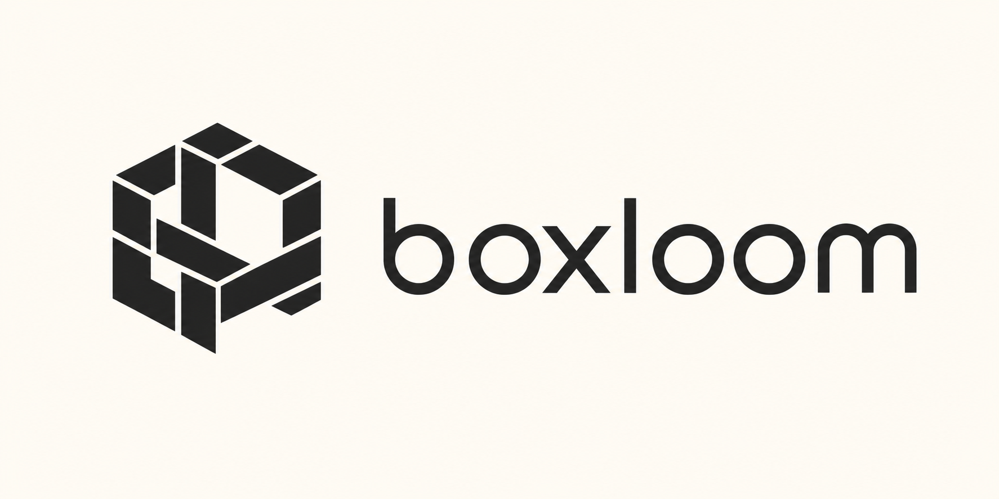
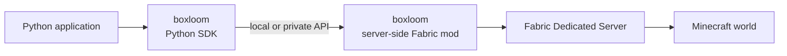

<p align="center">
  
</p>

# boxloom

boxloom is a Python SDK and server-side Fabric mod for controlling Minecraft Java Edition through an application-facing API.

This repository is intended to produce two distributable artifacts under the same name:

- Python package: `boxloom`
- Fabric mod: `boxloom`

> [!IMPORTANT]
> boxloom is in the early design stage. Its public API, wire protocol, supported versions, packaging, and release process are not stable yet.

## Overview

boxloom provides a small Python interface for reading and changing a Minecraft world. The Python SDK sends requests to the server-side Fabric mod, which validates each request and performs the corresponding operation in the Fabric server.



The SDK and mod are expected to communicate within the same machine or a trusted private network. The mod's internal API is not intended to be exposed directly to the public internet.

The repository contains the initial Fabric mod PoC, its versioned HTTP contract, and the first Python SDK implementation for `say`, `get_player_position`, and `set_block`.

## Goals

- Provide a focused, high-level Python API for Minecraft world operations
- Prefer directly exported functions for common operations
- Hide Fabric and Minecraft implementation details from Python applications
- Define a versioned contract between the Python SDK and the Fabric mod
- Return structured results and errors instead of relying on console output parsing
- Enforce operation permissions and limits on the server side
- Publish tested compatibility information for Minecraft, Fabric, Java, Python, the SDK, and the mod

## Components

### Python SDK

The Python package is responsible for:

- Exporting common Minecraft operations as top-level Python functions
- Providing `init()` for explicit connection configuration
- Resolving connection configuration and credentials
- Encoding requests and decoding responses
- Mapping protocol failures to documented Python exceptions
- Hiding transport and deployment details from application code

### Server-side Fabric mod

The Fabric mod is responsible for:

- Running inside a Fabric Dedicated Server
- Receiving requests from the Python SDK
- Validating the requested operation, target world, coordinates, and resource limits
- Scheduling world reads and changes in the correct Minecraft server execution context
- Returning structured results and errors
- Keeping server authority and validation independent from SDK behavior

## Connection configuration

By default, the Python SDK initializes the following connection settings from environment variables:

- `base_url` from `BOXLOOM_BASE_URL`: the boxloom Fabric mod API endpoint
- `auth_token` from `BOXLOOM_AUTH_TOKEN`: the token used to authenticate requests to the Fabric mod

Applications may override the environment-derived defaults by calling `init()` explicitly:

```python
from boxloom import init

init(auth_token="...", base_url="http://localhost:28886")
```

Calling `init()` is optional when the required environment variables are already configured. Values passed to `init()` take precedence over values read from the environment. The SDK must not include the authentication token in normal logs or error messages.

## API example

The public API should prefer directly imported functions for common Minecraft operations:

```python
from boxloom import get_player_position, say, set_block

say("Hello from boxloom!")
position = get_player_position("PlayerName")
x, y, z = position.block_coordinates()
set_block(x + 1, y - 1, z, "minecraft:gold_block", dimension=position.dimension)
```

The exported function set and detailed behavior are still under design. These examples document the intended API style, not a stable release contract.

## Security model

Callers of the internal API must be treated as untrusted, even when they use the official Python SDK.

- The Python SDK is not an authorization boundary
- The Fabric mod must validate every operation independently
- The internal API must not listen on a public network interface by default
- Authentication and authorization must be enforced at the server component boundary
- World, coordinate, operation, payload-size, and rate limits must be enforced server-side
- RCON and other administrative interfaces must not be part of the normal boxloom API path
- Credentials for hosting platforms or infrastructure control must never be exposed to Python applications

The PoC uses a Bearer token. The production authentication mechanism, transport security, rate limits, and permission model are still to be designed.

## Repository layout

boxloom uses a polyglot monorepo layout so the server and each language SDK remain independently buildable and publishable:

```text
boxloom/
|-- server/
|   |-- core/          # Shared HTTP, authentication, DTOs, and operation interface
|   `-- fabric/        # Fabric-specific server adapter and distributable mod
|-- sdks/
|   `-- <language>/    # Python first; other language SDKs can be siblings
|-- protocol/          # Language-neutral API contract
|-- docs/              # Architecture, compatibility, security, and ADRs
|-- examples/          # Examples grouped by SDK language
|-- tests/             # Cross-component integration tests
`-- README.md
```

See [Repository layout](docs/repository-layout.md) for the dependency boundaries and extension rules.

## Development setup

The repository uses mise for the shared development toolchain and tasks. mise installs Java 25 and uv at the versions resolved in `mise.lock`. The Python SDK then uses uv to select Python from `sdks/python/.python-version`, synchronize `.venv`, and lock Python dependencies in `uv.lock`.

```bash
mise install
mise run python-sync
mise run python-test
mise run python-build
mise run fabric-build
```

mise does not manage the Python interpreter directly in this repository. This keeps uv as the single authority for the Python project while mise coordinates the polyglot toolchain.

The Python SDK can be published manually to TestPyPI after adding a GitHub Actions secret. See [Publishing the Python SDK to TestPyPI](docs/python-testpypi-release.md).

## Scope

This repository is expected to contain:

- The boxloom Python SDK
- The boxloom server-side Fabric mod
- The SDK-to-mod API specification
- Compatibility and versioning documentation
- Integration tests and example programs
- Packaging and release automation for both artifacts

The following are outside the scope of this repository:

- Hosting or lifecycle management for Minecraft servers
- Browser-based editors, authentication gateways, and control planes
- Distribution of Minecraft Java Edition, the official launcher, or Minecraft assets
- General-purpose remote administration of Minecraft servers

## Compatibility

boxloom will publish a tested compatibility matrix. The initial implementation currently fixes the versions below.

| Component | Supported version |
| --- | --- |
| Minecraft Java Edition | `26.2` (initial PoC) |
| Fabric Loader | `0.19.3` (initial PoC) |
| Fabric API | `0.156.0+26.2` (initial PoC) |
| Java | `25` (initial PoC) |
| Python | `3.9+` (initial SDK) |
| boxloom Python SDK | `0.1.0` (initial implementation) |
| boxloom Fabric mod | `0.1.0` (initial PoC) |

boxloom will target explicitly tested combinations instead of automatically following snapshots or the newest dependency releases.

## Current decisions

- The Python package name is `boxloom`
- The server-side Fabric mod name is `boxloom`
- Server transports and validation live in `server/core`; Minecraft platform code lives in adapters
- Language SDKs live under `sdks/<language>/`
- The server-to-SDK contract lives under `protocol/`
- The initial protocol is authenticated JSON over HTTP with `/v1` paths
- Minecraft operations are exposed through an API rather than console-output parsing
- The Fabric mod is authoritative for validation and world access
- The SDK-to-mod endpoint is local or private and is not a public internet API
- Common operations should be exported as top-level Python functions
- The SDK reads `base_url` and `auth_token` defaults from environment variables
- Applications can override the environment-derived defaults with `init()`

## Open design questions

- How the initial HTTP protocol evolves beyond the PoC operations
- Repeated initialization, thread safety, and the lifecycle of global connection state
- Authentication, authorization, and credential rotation
- Hardening and cancellation semantics for the PoC's Minecraft server-thread handoff
- Timeouts, retries, idempotency, and cancellation
- Batch operations and partial failures
- The initial public Python API
- Version negotiation and compatibility policy
- Build, test, packaging, and release tooling

## Initial roadmap

1. Expand compatibility and security tests
2. Define packaging, versioning, and release workflows
3. Add read APIs and batch operations

## License

boxloom is available under the [MIT License](LICENSE).
